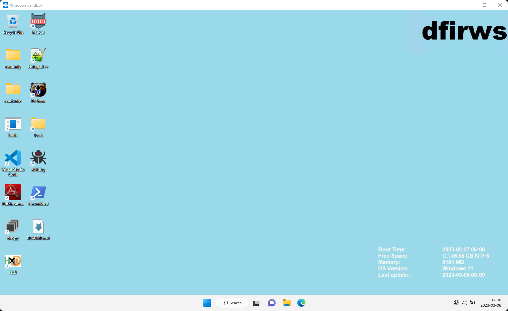

# DFIR in a Windows Sandbox - dfirws

DFIRWS is an easy way to do DFIR work in a [Windows Sandbox][wsa]. This can be useful if you can't install tools on your computer but are allowed to run a Windows Sandbox. By default Windows Defender isn't running in the sandbox which makes it easier to analyze malware. The scripts should work in Windows Sandbox on both Windows 10 and Windows 11.

[](https://github.com/marketplace/actions/super-linter)

## Requirements

You need to have git installed to download files and resources. 7-zip must be installed to extract files. Then rclone is used to copy only new files. Install the tools you miss with

```PowerShell
winget install 7zip.7zip
winget install Git.Git
winget install Rclone.Rclone
```

Other requirements are handled by starting different Windows sandboxes during download.

Windows Sandbox must be enabled on the host. You can enable it by running the Windows tool **Add and remove Windows features** and adding Windows Sandbox. An alternative is to open a windows terminal as adminstrator and run:

```PowerShell
Enable-WindowsOptionalFeature -FeatureName "Containers-DisposableClientVM" -All -Online
```

If you haven't enabled the option to run PowerShell scripts you have to start a Windows Terminal or PowerShell prompt and run

```PowerShell
Set-executionPolicy -ExecutionPolicy bypass
```

For more information about requirements for the sandbox look at Microsofts page [Windows Sandbox][wsa].

## Installation and configuration

Start a PowerShell terminal and checkout the code via Git.

```PowerShell
git clone https:/github.com/reuteras/dfirws.git
cd dfirws
```

Start the download of tools that are included in the sandbox. Sandboxes will be started to run and install packages for Python and NodeJS so don't have any sandbox running since Microsoft only allows one sandbox running. It will take some time since all tools are downloaded to disk. After the download the tools will be extracted and prepared for faster usage in the sandbox. Total space is currently around 8 GB. Download and preparation are done via

```PowerShell
.\downloadFiles.ps1
```

If you like to have a more detailed view off the progress during the download (or update) you can run the **PowerShell** variant of **tail -f** after starting **.\downloadFiles.ps1**.

```PowerShell
ls .\log\ | ForEach-Object -Parallel { Get-Content -Path $_ -Wait }
```

After download is finished you can create configuration files for the sandbox with your local path by running the following command:

```PowerShell
.\createSandboxConfig.ps1
```

Two different configurations will be created:

- dfirws.wsb - no network
- network_dfirws.wsb - network enabled

This will also create *./setup/config.txt* file. Select the tools you would like to be available in the sandbox here. All tools will still be downloaded and can be installed later in the sandbox if needed. You can also turn off Sysmon and specify the configuration file to use. By default the sandbox will use the old expanded format for right-click but that can be changed.

By default this sandbox will have clipboard redirection off as well as limit other settings. If you like to enable clipboard copy and paste you should change `<ClipboardRedirection>Disable</ClipboardRedirection>` to `<ClipboardRedirection>Enable</ClipboardRedirection>`. More information about [Windows Sandbox configuration][wsc].

## Usage

Start the sandbox by clicking on **dfirws.wsb** or running **./dfirws.wsb** in a PowerShell terminal. Startup takes a just under one minute on a fast computer with the default configuration. The following is an example screen of when the installation is done.



## Customize

Copy *.\local\example-customize.ps1* to *.\local\customize.ps1* and add your own PowerShell code to that file. Files needed by your script should be placed in the folder *.\local*.

## Update

Update scripts used to create the sandbox (i.e. this code) by running **git pull** and then update programs and tools by running **.\downloadFiles.ps1** again. Check *./setup/default-config.txt* for new configuration options.

## Documentation

The following tools are available.

- [Amazon Corretto][amc]
- [BeaconHunter][bhu]
- [binlex][bin]
- [Bytecode Viewer][bcv]
- [capa][cap]
- [chainsaw][cha]
- [cmder][cer] (will probably be removed in favour of git bash)
- [Cutter][cut]
- [CyberChef][cyb]
- [debloat][deb]
- [DensityScout][den]
- [dnSpy][dns] (by dnSpyEx which is a unofficial continuation of the dnSpy project)
- [exiftool][ext]
- [flare-fakenet-ng][ffn]
- [flare-floss][flf]
- [fq][fq]
- [FullEventLogView][fel]
- [Ghidra][ghi]
- [Git][git] for Windows (includes git bash)
- [GoReSym][grs]
- [Hayabusa][hay]
- [HxD][hxd]
- [jq][jq]
- [Jumplist-Browser][jub]
- [LibreOffice][lio]
- [LOKI][lok]
- [Malcat][mal]
- [MessageViewer][mev]
- [ncat][nca]
- [Notepad++][not] with the following added plugins:
  - [comparePlus][ncp]
- [PdfStream Dumper][psd]
- [PE-bear][peb]
- [PersistenceSniper][per]
- [PEstudio][pes]
- [Prefetch-Browser][prb]
- [pstwalker][pst]
- [Python][pyt]
- [QPDF][qpd]
- [Radare2][rad]
- [ripgrep][rip]
- [scdbg][scd]
- [sqlite][sql] cli
- [SysinternalsSuite][syi]
- [Sysmon][sym] started with [SwiftOnSecurity sysmon-config][sws]
- [System Informer][sin] (formerly ProcessHacker)
- [Thumbcache viewer][thu]
- [TrID][tri]
- [x64dbg][xdb]
- [UniExtract2][ue2]
- [upx][upx]
- [visidata][vis]
- [Visual Studio Code][vsc]
  - [Powershell extension][vpe]
- [yara][yar]
- [Zimmerman Tools][zim]
- [Zui][zui] formerly named Brim
- [Selected][sdi] scripts from [Didier Stevens][dis]
- Selected pip packages for [Python][pip]

Downloaded but not installed by default:

- [Wireshark][wis]
- [npcap][npc] (requires manual install)

Downloaded git repositories:

- [https://github.com/keydet89/Events-Ripper.git](https://github.com/keydet89/Events-Ripper.git)
- [https://github.com/last-byte/PersistenceSniper.git](https://github.com/last-byte/PersistenceSniper.git)
- [https://github.com/Neo23x0/evt2sigma.git](https://github.com/Neo23x0/evt2sigma.git)
- [https://github.com/pan-unit42/dotnetfile](https://github.com/Neo23x0/evt2sigma.git)
- [https://github.com/reuteras/dfirws.wiki.git](https://github.com/reuteras/dfirws.wiki.git)
- [https://github.com/SigmaHQ/sigma.git](https://github.com/SigmaHQ/sigma.git)
- [https://github.com/volexity/threat-intel.git](https://github.com/volexity/threat-intel.git)
- [https://github.com/wagga40/Zircolite](https://github.com/wagga40/Zircolite)
- [https://github.com/Yamato-Security/hayabusa-rules.git](https://github.com/Yamato-Security/hayabusa-rules.git)

More information about tools are available in the GitHub [wiki][wid].

  [amc]: https://docs.aws.amazon.com/corretto/
  [bcv]: https://github.com/Konloch/bytecode-viewer
  [bhu]: https://github.com/3lp4tr0n/BeaconHunter
  [bin]: https://github.com/c3rb3ru5d3d53c/binlex
  [cap]: https://github.com/mandiant/capa
  [cer]: https://github.com/cmderdev/cmder
  [cha]: https://github.com/WithSecureLabs/chainsaw
  [cut]: https://github.com/rizinorg/cutter
  [cyb]: https://github.com/gchq/CyberChef
  [deb]: https://github.com/Squiblydoo/debloat
  [den]: https://cert.at/en/downloads/software/software-densityscout
  [dis]: https://github.com/DidierStevens/DidierStevensSuite
  [dns]: https://github.com/dnSpyEx/dnSpy
  [ext]: https://exiftool.org/
  [fel]: https://www.nirsoft.net/utils/full_event_log_view.html
  [ffn]: https://github.com/mandiant/flare-fakenet-ng
  [flf]: https://github.com/mandiant/flare-floss
  [fq]:  https://github.com/wader/fq
  [ghi]: https://github.com/NationalSecurityAgency/ghidra
  [git]: https://github.com/git-for-windows/git/
  [grs]: https://github.com/mandiant/GoReSym
  [hay]: https://github.com/Yamato-Security/hayabusa
  [hxd]: https://mh-nexus.de/
  [jq]:  https://github.com/stedolan/jq
  [jub]: https://github.com/kacos2000/Jumplist-Browser
  [lio]: https://www.libreoffice.org/
  [lok]: https://github.com/Neo23x0/Loki
  [mal]: https://malcat.fr/
  [mev]: https://github.com/lolo101/MsgViewer
  [nca]: https://nmap.org/ncat/
  [ncp]: https://github.com/pnedev/comparePlus
  [not]: https://notepad-plus-plus.org/
  [npc]: https://npcap.com/
  [peb]: https://github.com/hasherezade/pe-bear
  [per]: https://github.com/last-byte/PersistenceSniper
  [pes]: https://www.winitor.com/
  [pip]: ./resources/download/python.ps1
  [prb]: https://github.com/kacos2000/Prefetch-Browser
  [psd]: https://github.com/dzzie/pdfstreamdumper/
  [pst]: https://www.pstwalker.com/blog/convert-pst-to-msg.html
  [pyt]: https://python.org/
  [qpd]: https://github.com/qpdf/qpdf
  [rad]: https://www.radare.org/n/
  [rip]: https://github.com/BurntSushi/ripgrep
  [scd]: https://github.com/dzzie/VS_LIBEMU
  [sdi]: ./resources/download/didier.ps1
  [sin]: https://github.com/winsiderss/systeminformer
  [sql]: https://sqlite.org/
  [sws]: https://github.com/SwiftOnSecurity/sysmon-config
  [syi]: https://learn.microsoft.com/en-us/sysinternals/
  [sym]: https://learn.microsoft.com/en-us/sysinternals/downloads/sysmon
  [thu]: https://thumbcacheviewer.github.io/
  [tri]: https://mark0.net/soft-trid-e.html
  [ue2]: https://github.com/Bioruebe/UniExtract2
  [upx]: https://github.com/upx/upx
  [vis]: https://www.visidata.org/
  [vpe]: https://github.com/PowerShell/vscode-powershell/
  [vsc]: https://code.visualstudio.com/
  [wid]: https://github.com/reuteras/dfirws/wiki/Documentation
  [wis]: https://wireshark.org/
  [wsa]: https://learn.microsoft.com/en-us/windows/security/threat-protection/windows-sandbox/windows-sandbox-overview
  [wsc]: https://learn.microsoft.com/en-us/windows/security/threat-protection/windows-sandbox/windows-sandbox-configure-using-wsb-file
  [xdb]: https://x64dbg.com/
  [yar]: https://github.com/VirusTotal/yara
  [zim]: https://github.com/EricZimmerman
  [zui]: https://github.com/brimdata/zui
