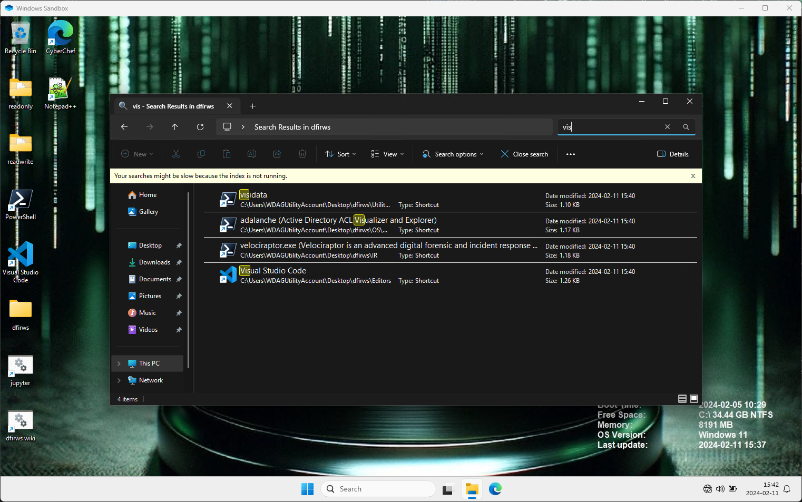

# dfirws: DFIR in Windows

[](https://github.com/marketplace/actions/super-linter)

DFIRWS is a solution to do DFIR work in Windows. To avoid having to download and install tools manually from many different sources, the tools are downloaded and prepared for use in a Windows Sandbox or VM.

DFIRWS has been enhanced since its start and now have the following main parts.

- **downloadFiles.ps1** - download, update and prepare tools to use for DFIR work.
- **enrichment.ps1** - download data for later enrichment. Currently downloads data from TOR, MaxMind (if you have a key) and a couple of other sources.
- **createSandboxConfig.ps1** - create Windows Sandbox configuration files for the tools.
  - **dfirws.wsb** - Windows Sandbox configuration file with network disabled.
  - **network_dfirws.wsb** - Windows Sandbox configuration file with network enabled.
- **createVM.ps1** - create a Windows 11 VM with the tools installed.

DFIRWS should work with the Windows Sandbox in both Windows 10 and Windows 11 even tough currently I only test it on Windows 11. The VM only creates a Windows 11 VM and currently only uses VMWare Workstation.

**Recommendation:** Exclude the folder where you have the dfirws code from your antivirus program. The reason is that at least Windows Defender will some time classify some tools as malware. Even though I try to exclude those tools I've found that a file can be classified as malware one day and not the next. The choice is yours.

## Table of contents

- [Preparation](#preparation)
- [Installation and configuration](#installation-and-configuration)
- [Download tools and enrichment data](#download-tools-and-enrichment-data)
- [Usage and configuration of the sandbox](#usage-and-configuration-of-the-sandbox)
- [Usage and configuration of the VM](#usage-and-configuration-of-the-vm)
- [Update](#update)
- [Documentation](#documentation)

## Preparation

1. *Programs:* You need to have the programs **7-zip**, **Git** and **Rclone** installed on your computer to be able to use DFIRWS. If you miss any of the tools you can install them with **winget** by typing the following commands.

```PowerShell
winget install 7zip.7zip
winget install Git.Git
winget install Rclone.Rclone
```

2. *PowerShell:* If you haven't enabled the option to run PowerShell scripts you have to start a Windows Terminal or PowerShell prompt as administrator and run

```PowerShell
Set-executionPolicy -ExecutionPolicy Bypass
```

3. *Windows Sandbox:* The Windows Sandbox feature must be enabled on the host. This is true even if you only like to build and run the DFIRWS tools in a VM. The Sandbox feature is used to build some tools when you run the **downloadFiles.ps1** script.
You can enable the Sandbox feature by using the **Add and remove Windows features** in Windows and add *Windows Sandbox*. An alternative way is to open a Windows terminal as administrator and run:

```PowerShell
Enable-WindowsOptionalFeature -FeatureName "Containers-DisposableClientVM" -All -Online
```

For more information about Windows Sandbox look at the Microsoft page [Windows Sandbox][wsa].

4. *GitHub classic token:* You also need a GitHub account to create a classic GitHub token. If you have a GitHub account you can create a token at [https://github.com/settings/tokens](https://github.com/settings/tokens). Select *Generate new token (classic)*. Give the token a name and change the default expiration. The token doesn't need any added rights.
Remember to save the token in your password manager since you can't get the value again.

The token is needed to avoid problems with rate limiting on GitHub since most of the tools are downloaded from there and you will be blocked otherwise.

5. *MaxMind token (optional):* If you like to use MaxMind data you need a token from [https://www.maxmind.com/en/geolite2/signup](https://www.maxmind.com/en/geolite2/signup).

## Installation and configuration

Start a PowerShell terminal as your regular user and checkout the code from GitHub with the **git** command.

```PowerShell
git clone https://github.com/reuteras/dfirws.git
cd dfirws
```

Create the configuration files for the sandbox by running:

```PowerShell
.\createSandboxConfig.ps1
```

Two different configurations will be created:

- dfirws.wsb - network disabled
- network_dfirws.wsb - network enabled

Copy the file *config.ps1.template* to *config.ps1*.

```PowerShell
cp config.ps1.template config.ps1
```

The file *config.ps1* is used by the scripts to specify token for MaxMind and GitHub. The MaxMind token is only used if you would like the **enrichment.ps1** script. If you prefer not to save the GitHub token in the *config.ps1* file you can enter it manually every time you run **downloadFiles.ps1**.

There is also a setting that controls if the Python *jep* virtual environment should be built (needed for Ghidrathon). There is a requirement for Visual Studio to build this virtual environment which is a rather large download and therefore optional.

## Download tools and enrichment data

Before using a sandbox or creating a VM all the tools has to be downloaded and prepared for use in DFIRWS. Sandboxes will be started to run and install packages for Python, bash, Rust and NodeJS. Since Windows only allows on running Sandbox at the time you have to close any running sandbox before running **downloadFiles.ps1**.

Download programs and prepare them for use by running:

```PowerShell
.\downloadFiles.ps1
```

If you like to have a more detailed view off the progress during the download (or update) you can run the **PowerShell** variant of **tail -f** after starting **.\downloadFiles.ps1**.

```PowerShell
Get-Content .\log\log.txt -Wait
```

Enrichment data can be downloaded by running:

```PowerShell
.\enrichment.ps1
```

## Usage and configuration of the sandbox

The quickest way to use the tool is to start a sandbox by clicking on **dfirws.wsb** or running **./dfirws.wsb** in a PowerShell terminal. The sandbox will start and the tools will be available after a couple of minutes.

The goal for startup time is set to around two minutes on a computer with a Intel Core i7 and the default configuration. The following is an example screen of the sandbox running after start.


You can use the search field to find the tools you like to use. See example below.



By default the sandbox will have clipboard redirection off as well as secure defaults for other settings. If you like to enable clipboard copy and paste you should change `<ClipboardRedirection>Disable</ClipboardRedirection>` to `<ClipboardRedirection>Enable</ClipboardRedirection>`. More information about [Windows Sandbox configuration][wsc].

To customize the sandbox you can copy *local/default-config.txt* to *local/config.txt* and change the settings to your liking. The file *local/config.txt* is used by the scripts to specify which tools to install when the sandbox starts. Every tool will still be downloaded and can be installed later in the sandbox if needed.
The difference will be the time it takes to start the sandbox, i.e. running an installer for a program on every start.

Extra tools can be installed in a running **dfirws** sandbox with the script **dfirws-install.ps1**. To list available tools run **Get-Help dfirws-install.ps1**. To install a tool run **dfirws-install.ps1 -<tool>**.

If you like to run your own PowerShell code to customize **dfirws** you can copy *local/customize.ps1* to *local/customize.ps1* and modify it. Observe that the latest version of PowerShell will be installed when you start **dfirws** which at the moment is PowerShell 7 and that some things are different from earlier versions of PowerShell.

More usage information is available in the [wiki](https://github.com/reuteras/dfirws/wiki). A local copy of the wiki is available by clicking on the **dfirws wiki** link on the desktop.

## Usage and configuration of the VM

You can create a VM with the dfirws tools installed by running **.\createVM.ps1**. Currently only VMWare Workstation is supported on Windows x64. The script will download the Windows 11 Enterprise ISO from Microsoft and create a VM with the tools installed. The VM will be created  in the root folder of the checked out repository.

- The VM will be created with 4 cores and 16 GB of memory.
- The VM will be created with a 300 GB sparse disk (space is not preallocated).
- The VM will be created with a NAT network adapter.
- The VM will be created with a user named *dfirws* with password *password*.

You can change the settings by copying *local/default-variables.pkr.hcl* to *local/variables.pkr.hcl* and modify the settings to your liking. You can for example change setting for autounattend to change the default keyboard to US (Swedish is the default).

Currently there is now way to update the tolls in the VM. You have to delete the VM and run **.\createVM.ps1** again.

## Update

Update scripts used to create the sandbox (i.e. this code) by running **git pull** and then update the tools by running **.\downloadFiles.ps1** again. Check *./local/default-config.txt* for changed and added configuration options. You can also opt to only update parts of the included tools. To update Python tools run:

```PowerShell
.\downloadFiles.ps1 -Python
```

To see available options run **Get-Help .\downloadFiles.ps1**.

## Documentation

More information about installed tools are available in the GitHub [wiki][wid].

  [wid]: https://github.com/reuteras/dfirws/wiki/Documentation
  [wsa]: https://learn.microsoft.com/en-us/windows/security/threat-protection/windows-sandbox/windows-sandbox-overview
  [wsc]: https://learn.microsoft.com/en-us/windows/security/threat-protection/windows-sandbox/windows-sandbox-configure-using-wsb-file
