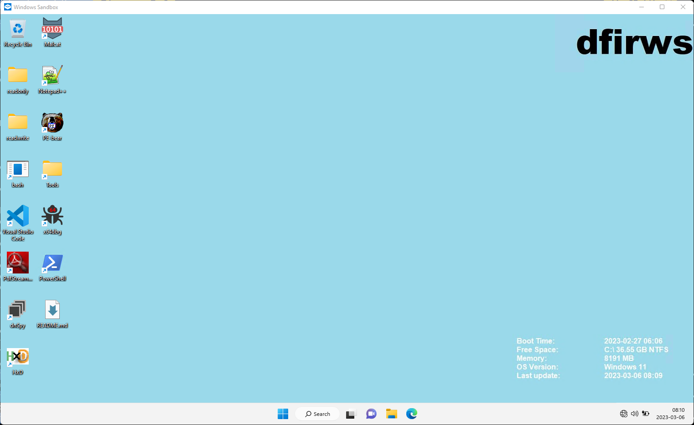
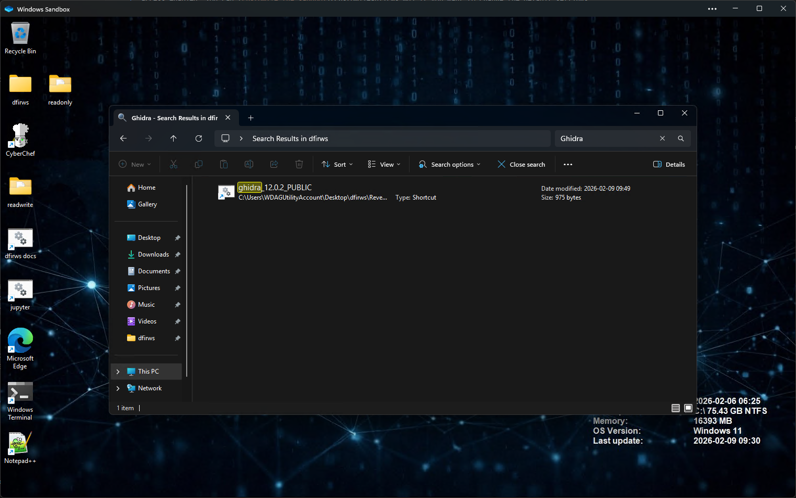

# dfirws: DFIR in Windows Sandbox

[](https://github.com/marketplace/actions/super-linter)

DFIRWS is a solution to do digital forensics and incident response analysis work in a Windows Sandbox. There are many great tools available for DFIR work but it can be time consuming to set up a good environment and keep it updated with the tools you like to use. The second problem that the script can solve is use of updates of tools in an offline environment. This is the problems DFIRWS tries to solve.

The first part of DFIRWS downloads and updates the included tools. This is handled by the **downloadFiles.ps1** script. The second part of DFIRWS is the scripts that either starts and configures a Windows Sandbox or installs the tools in a Windows VM. The primary use case is the Windows Sandbox. Third part of DFIRWS is a collection of scripts to sync the tools to an offline environment.

**Recommendation:** Exclude the folder where you have the dfirws code from your antivirus program. I don't want to have to recommend this but the reason is that AV tools classify some legitimate tools as malware. The choice is yours.

## Table of contents

- [Preparation and requirements](#preparation-and-requirements)
- [Installation and configuration](#installation-and-configuration)
- [Download tools and enrichment data](#download-tools-and-enrichment-data)
- [Usage and configuration of the sandbox](#usage-and-configuration-of-the-sandbox)
  - [Distribution profiles](#distribution-profiles)
  - [Sandbox configuration](#sandbox-configuration)
- [Usage and configuration of the VM](#usage-and-configuration-of-the-vm)
- [Update tools](#update-tools)

## Preparation and requirements

1. *Programs:* You need to have the programs `winget`, `7-zip`, `git` and `rclone` installed on your computer to be able to use DFIRWS. If you miss any of the tools you can install them with **winget** by typing the following commands assuming you have `winget` installed and working.

```PowerShell
winget install 7zip.7zip
winget install Git.Git
winget install Rclone.Rclone
```

You also can't have `curl` as a PowerShell alias to `Invoke-WebRequest` since the scripts use `curl` to download files and if it's an alias it will fail since `Invoke-WebRequest` doesn't support the same syntax. The `downloadFiles.ps1` script will check if `curl` is an alias and check for the other tools as well.

2. *PowerShell:* If you haven't enabled the option to run PowerShell scripts you have to start a Windows Terminal or PowerShell prompt as administrator and run

```PowerShell
Set-ExecutionPolicy -ExecutionPolicy Bypass
```

**Important:** This must be done for both **PowerShell** and **pwsh**.

3. *Windows Sandbox:* The Windows Sandbox feature must be enabled on the host. This is true even if you only like to build and run the DFIRWS tools in a VM. The Sandbox feature is used to build and download tools when you run the **downloadFiles.ps1** script.
You can enable the Sandbox feature by using the **Add and remove Windows features** in Windows and add *Windows Sandbox*. An alternative way is to open a Windows terminal as administrator and run:

```PowerShell
Enable-WindowsOptionalFeature -FeatureName "Containers-DisposableClientVM" -All -Online
```

For more information about Windows Sandbox look at the Microsoft page [Windows Sandbox][wsa].

4. *GitHub token:* You also need a GitHub account to create a GitHub token. If you have a GitHub account you can create a token at [https://github.com/settings/tokens](https://github.com/settings/tokens). Select *Generate new token (Fine grained or classic)*. Give the token a name and change the default expiration. The token doesn't need any added rights.
Remember to save the token in your password manager since you can't get the value again.

The token is needed to avoid problems with rate limiting on GitHub since most of the tools are downloaded from there and you will be blocked otherwise and the downloads will fail.

5. *MaxMind token (optional):* If you like to use MaxMind data you need a token from [https://www.maxmind.com/en/geolite2/signup](https://www.maxmind.com/en/geolite2/signup).

6. *IPinfo token (optional):* If you like to use IPinfo data you need a token from [https://ipinfo.io/signup](https://ipinfo.io/signup).

## Installation and configuration

Start a PowerShell terminal as your regular user and checkout the code from GitHub with the `git` command.

```PowerShell
git clone https://github.com/reuteras/dfirws.git
cd dfirws
```

Create the configuration files for the sandbox by running:

```PowerShell
.\createSandboxConfig.ps1
```

Two different configurations for sandboxes will be created:

- dfirws.wsb - network disabled
- network_dfirws.wsb - network enabled

Next copy the file *dfirws-config.ps1.template* to *dfirws-config.ps1*.

```PowerShell
cp dfirws-config.ps1.template dfirws-config.ps1
```

The file *dfirws-config.ps1* is used by the scripts to specify token for MaxMind and GitHub. If you prefer not to save the GitHub token in *dfirws-config.ps1* file you can enter it manually when you run **downloadFiles.ps1**. Another safer alternative is to use your password manager and enter the cli command to get the token from the password manager. Examples for 1Password are available in the file *dfirws-config.ps1.template*.

## Download tools and enrichment data

Before using a sandbox or creating a VM all the tools has to be downloaded and prepared for use in DFIRWS. Sandboxes will be started to run and install packages for Python, bash, Rust, Node.js and more. Since Windows only allows one running Sandbox at the time you have to close any running sandbox before running **downloadFiles.ps1**.

Download programs and prepare them for use by running:

```PowerShell
.\downloadFiles.ps1 -AllTools
```

Enrichment data can be downloaded by running:

```PowerShell
.\downloadFiles.ps1 -Enrichment
```

ClamAV signatures can be downloaded with freshclam by running:

```PowerShell
.\downloadFiles.ps1 -Freshclam
```

To simplify the download of tools, enrichment data and ClamAV signatures you can run the following command:

```PowerShell
.\downloadFiles.ps1 -AllTools -Enrichment -Freshclam
```

To run the verify code you can run the following command:

```PowerShell
.\downloadFiles.ps1 -Verify
```

If you like to cache a local copy of Visual Studio Build Tools you can run. **Important: The Visual Studio Build Tools downloader runs on the host and not in a sandbox!**

```PowerShell
.\downloadFiles.ps1 -VisualStudioBuildTools
```

Personally I run the following command to download everything and cache Visual Studio Build Tools and run the verify code as well.

```PowerShell
.\downloadFiles.ps1 -AllTools -Enrichment -Freshclam -LogBoost -VisualStudioBuildTools -Verify
```

Below is a diagram of the download process of the tools and enrichment data.

```text
downloadFiles.ps1
│
├─[prerequisites]
│   ├── resources\download\common.ps1     (common functions + date logging)
│   ├── dfirws-config.ps1                 (GitHub credentials, paths)
│   │    └── dfirws-config.ps1.template   (fallback)
│   ├── local\defaults\profiles.ps1       (profile definitions: Basic / Full)
│   └── local\profile-config.ps1          (user overrides, if present)
│
├─[profile resolution]  (determines which scripts/tools run)
│   │
│   ├── -DistributionProfile <name>        (CLI flag, highest priority)
│   ├── $DFIRWS_PROFILE                    (from local\profile-config.ps1)
│   └── (none)                             (Full — everything included)
│        │
│        └── active profile controls:
│             ├── $DFIRWS_EXCLUDE_TOOLS     tools skipped in http/release/etc.
│             ├── $DFIRWS_EXCLUDE_GIT_REPOS git repos to skip
│             ├── profileNodeEnabled        enable/disable node.ps1
│             ├── profileRustEnabled        enable/disable rust.ps1
│             ├── profileGoEnabled          enable/disable go.ps1
│             └── profileMsys2Enabled       enable/disable msys2.ps1
│                  │
│                  └── per-script overrides in local\profile-config.ps1:
│                       DFIRWS_PROFILE_NODE / _RUST / _GO / _MSYS2
│                       DFIRWS_EXTRAS  (re-include excluded tools)
│
├─[guard checks]
│   ├── git.exe, rclone.exe, 7z.exe, winget.exe  must be in PATH
│   ├── curl must not be a PS alias  (bypass: -AllowCurlAlias)
│   ├── rclone config touch
│   └── WindowsSandbox must not be running
│
├─[GitHub credentials]  (needed by: -Didier -GoLang -Http -Python -Release)
│   ├── dfirws-config.ps1  GITHUB_USERNAME / GITHUB_TOKEN  (if configured)
│   └── Read-Host prompt   (fallback)
│
├─[download scripts]
│   │
│   ├── resources\download\basic.ps1          always first when toolchains run
│   │    (installers needed by node/go/rust/msys2/python/freshclam/logboost)
│   │
│   ├── resources\download\release.ps1        -Release  | -AllTools
│   │    └── GitHub releases  →  mount\Tools\
│   │
│   ├── resources\download\http.ps1           -Http  | -AllTools
│   │    ├── direct HTTP/HTTPS downloads  →  mount\Tools\  downloads\
│   │    └── VSCode extensions  (skip with -HttpNoVSCodeExtensions)
│   │
│   ├── resources\download\git.ps1            -Git  | -AllTools
│   │    └── git clone/pull repos  →  mount\git\
│   │         (skips repos in $DFIRWS_EXCLUDE_GIT_REPOS)
│   │
│   ├── resources\download\didier.ps1         -Didier  | -AllTools
│   │    └── Didier Stevens tools  →  mount\Tools\
│   │
│   ├── resources\download\winget.ps1         -Winget  | -AllTools
│   │    └── winget install  →  system
│   │
│   ├── resources\download\zimmerman.ps1      -Zimmerman  | -AllTools
│   │    └── Get-ZimmermanTools  →  mount\Tools\Zimmerman\
│   │
│   ├── resources\download\kape.ps1           -Kape  | -AllTools
│   │    └── requires local\kape.zip          →  mount\Tools\KAPE\
│   │
│   ├── resources\download\powershell.ps1     -PowerShell  | -AllTools
│   │    └── PS modules + latest pwsh  →  mount\Tools\
│   │
│   ├── resources\download\node.ps1           -Node  | -AllTools (if profile allows)
│   │    └── Node + npm packages  →  mount\Tools\node\
│   │
│   ├── resources\download\msys2.ps1          -MSYS2  | -AllTools (if profile allows)
│   │    └── MSYS2 + packages  →  mount\Tools\msys2\
│   │
│   ├── resources\download\go.ps1             -GoLang  | -AllTools (if profile allows)
│   │    └── Go toolchain + packages  →  mount\golang\
│   │
│   ├── resources\download\python.ps1         -Python  | -AllTools
│   │    └── Python venvs + packages  →  mount\venv\
│   │
│   ├── resources\download\rust.ps1           -Rust  | -AllTools (if profile allows)
│   │    └── Rust toolchain + cargo crates  →  mount\Tools\
│   │
│   ├── resources\download\freshclam.ps1      -Freshclam  (explicit only)
│   │    └── ClamAV databases  →  downloads\
│   │
│   ├── resources\download\enrichment.ps1     -Enrichment  (explicit only)
│   │    └── threat intel / GeoIP / IOC data  →  enrichment\
│   │
│   └── resources\download\logboost.ps1       -LogBoost  | -AllTools
│        └── LogBoost threat intel  →  downloads\
│             (skipped if "LogBoost" in $DFIRWS_EXCLUDE_TOOLS)
│
├─[optional]
│   └── resources\download\visualstudiobuildtools.ps1   -VisualStudioBuildTools
│
├─[post-download copies]
│   ├── README.md                   →  downloads\
│   ├── resources\images\dfirws.jpg →  downloads\
│   ├── setup\utils\PowerSiem.ps1   →  mount\Tools\bin\
│   └── downloads\done.txt           (timestamp, read by bginfo in sandbox)
│
├─[optional verify]  (-Verify)
│   └── resources\download\verify.ps1
│        └── checks tool availability, writes  log\verify.txt
│
├─[cleanup]
│   └── Remove  tmp\downloads\  tmp\enrichment\  tmp\mount\  tmp\msys2\
│
└─[log scan]
     ├── log\*  →  scan for "warning" / "error" / "Failed"
     └── report unexpected issues to console
```

### Distribution profiles

DFIRWS supports distribution profiles to control which tools are downloaded. This is useful for standalone or external client installations where you don't need the full tool suite.

Two profiles are available:

- **Full** (default) - Downloads all tools, including all build toolchains (Node.js, Rust, Go, MSYS2) and large optional tools.
- **Basic** - Skips Rust, Go, and MSYS2 toolchains. Keeps Node.js for JavaScript malware analysis. Excludes large optional tools like Autopsy, ELK Stack, Binary Ninja, Neo4j, hashcat, LibreOffice, and others.

To use a profile, pass `-DistributionProfile` to `downloadFiles.ps1`:

```PowerShell
.\downloadFiles.ps1 -DistributionProfile Basic
```

For persistent configuration, copy `local\defaults\profile-config.ps1.template` to `local\profile-config.ps1` and set `$DFIRWS_PROFILE = "Basic"`. You can also override individual toolchain inclusion and add extras (large tools to include despite the profile):

```PowerShell
$DFIRWS_PROFILE = "Basic"
$DFIRWS_EXTRAS = @("Autopsy", "LibreOffice")
```

The `-DistributionProfile` CLI parameter takes precedence over the config file. Explicit switches like `-Rust` or `-Node` always override the profile setting.

## Usage and configuration of the sandbox

### Sandbox configuration

The quickest way to use the DFIRWS is to start a sandbox by clicking on **dfirws.wsb** or running **.\dfirws.wsb** in a PowerShell terminal. The sandbox will start and the tools will be available after a couple of minutes.



You can use the search field in **explorer** to find the tools you like to use. See example below.



By default the sandbox will have clipboard redirection off as well as secure defaults for other settings. If you like to enable clipboard copy and paste you should change `<ClipboardRedirection>Disable</ClipboardRedirection>` to `<ClipboardRedirection>Enable</ClipboardRedirection>` in the file *dfirws.wsb*. More information about [Windows Sandbox configuration][wsc] by Microsoft.

To customize the sandbox you can copy *local\defaults\config.txt* to *local\config.txt* and change the settings to your liking. The file *local\config.txt* is used by the scripts to specify which tools to install when the sandbox starts. This configuration is only for the sandbox and does not affect the download process by *downloadFiles.ps1*. The difference will be the time it takes to start the sandbox, i.e. running an installer for a program on every start.

Extra tools can be installed in a running **dfirws** sandbox with the script **dfirws-install.ps1**. To list tools that are available to install run **Get-Help dfirws-install.ps1**. To install a tool run **dfirws-install.ps1 -<tool>**.

If you like to run your own PowerShell code to customize the **dfirws** sandbox you can copy *local\defaults\customize-sandbox.ps1* to *local\customize.ps1* and modify it. Observe that the latest version of PowerShell will be installed when you start **dfirws** and that version will be used to run the script. Currently this is PowerShell 7.4.x and some things are different from earlier versions of PowerShell.

More information is available in the [documentation](https://reuteras.github.io/dfirws/). A local copy of the documentation is available by clicking on the **dfirws docs** link on the desktop.

The startup process of the sandbox is illustrated in the diagram below.

```text
dfirws.wsb  (or network_dfirws.wsb)
│
├─[mapped folders, read-only unless noted]
│   ├── setup\              →  C:\Users\WDAGUtilityAccount\Documents\tools\
│   ├── mount\git\          →  C:\git\
│   ├── mount\Tools\        →  C:\Tools\
│   ├── mount\venv\         →  C:\venv\
│   ├── mount\golang\       →  C:\Users\WDAGUtilityAccount\go\
│   ├── downloads\          →  C:\downloads\
│   ├── enrichment\         →  C:\enrichment\
│   ├── local\              →  C:\local\
│   ├── readonly\           →  Desktop\readonly\   (read-only)
│   └── readwrite\          →  Desktop\readwrite\  (read-write)
│
└─[LogonCommand]
   └── setup\start_sandbox.ps1
        │
        ├── setup\wscommon.ps1          (common functions)
        │
        ├─[config]
        │   ├── C:\local\config.txt           (if present)
        │   └── C:\local\defaults\config.txt  (fallback)
        │        │
        │        ├── WSDFIR_NOTEPAD        Yes/No
        │        ├── WSDFIR_NEOVIM         Yes/No
        │        ├── WSDFIR_TEXT_EDITOR    notepad_plus_plus | nvim
        │        ├── WSDFIR_VSCODE_*       Yes/No  (PowerShell/C/Python/
        │        │                                   Spell/Mermaid/Shellcheck/
        │        │                                   ruff/YARA extensions)
        │        ├── WSDFIR_SYSMON         Yes/No
        │        ├── WSDFIR_SYSMON_CONF    path to sysmonconfig.xml
        │        ├── WSDFIR_RIGHTCLICK     Yes/No
        │        ├── WSDFIR_DARK           Yes/No
        │        ├── WSDFIR_HIDE_TASKBAR   Yes/No
        │        ├── WSDFIR_START_MENU     Yes/No
        │        ├── WSDFIR_OHMYPOSH       Yes/No
        │        ├── WSDFIR_OHMYPOSH_CONFIG path to .omp.json
        │        └── WSDFIR_FONT_NAME/FULL_NAME
        │
        ├─[base installs]
        │   ├── 7-Zip
        │   ├── PSDecode module
        │   ├── PowerShell 7
        │   ├── Java (Corretto)
        │   ├── Python 3
        │   ├── Visual C++ Redistributable
        │   └── .NET 6 / 8 / 9
        │
        ├─[optional installs]  (controlled by config.txt)
        │   ├── Notepad++       (WSDFIR_NOTEPAD=Yes)
        │   └── Neovim          (WSDFIR_NEOVIM=Yes)
        │
        ├─[environment config]
        │   ├── OhMyPosh
        │   ├── HxD
        │   ├── IrfanView
        │   ├── Windows Terminal  (from C:\Tools)
        │   ├── Registry settings  (reg\registry.reg)
        │   ├── PowerShell profile
        │   │    ├── C:\local\Microsoft.PowerShell_profile.ps1
        │   │    └── C:\local\defaults\Microsoft.PowerShell_profile.ps1
        │   ├── Text editor associations  (WSDFIR_TEXT_EDITOR)
        │   ├── Office file right-click menu  (WSDFIR_RIGHTCLICK=Yes)
        │   ├── Date/time format  (ISO 8601)
        │   ├── Dark theme        (WSDFIR_DARK=Yes)
        │   ├── Wallpaper
        │   ├── Hide taskbar      (WSDFIR_HIDE_TASKBAR=Yes)
        │   ├── Firewall disabled
        │   └── PATH  (C:\Tools\*  C:\git\*  C:\venv\bin  etc.)
        │
        ├─[tool config]
        │   ├── Graphviz
        │   ├── Cutter plugins   (from C:\git)
        │   ├── BeaconHunter / IDR
        │   ├── Jupyter notebooks + config
        │   ├── Zimmerman tools  (iisGeolocate + GeoLite2 DB if present,
        │   │                     RegistryExplorer, ShellBagsExplorer,
        │   │                     TimelineExplorer)
        │   ├── geolocus DB      (from C:\enrichment, if present)
        │   ├── mvt IOCs         (from C:\venv\iocs\mvt, if present)
        │   ├── opencode-ai config
        │   │    ├── C:\local\opencode.json
        │   │    └── C:\local\defaults\opencode.json
        │   ├── opencode-ai skills
        │   │    ├── C:\local\opencode-skills\
        │   │    └── C:\local\defaults\opencode-skills\
        │   ├── .zshrc
        │   │    ├── C:\local\.zshrc
        │   │    └── C:\local\defaults\.zshrc
        │   └── Desktop shortcuts  (jupyter, dfirws docs, Windows Terminal,
        │                           dfirws tools folder)
        │
        ├─[customization]  (Sandbox only, skipped when run in VM)
        │   ├── C:\local\customize.ps1            (if present)
        │   ├── C:\local\customise.ps1             (alternate spelling)
        │   └── C:\local\defaults\customize-sandbox.ps1  (fallback)
        │
        └─[optional]
            └── Sysmon  (WSDFIR_SYSMON=Yes, config: WSDFIR_SYSMON_CONF)
```

## Usage and configuration of the VM

You can create a VM with the dfirws tools installed by running **.\createVM.ps1**. Currently only VMWare Workstation is supported on Windows x64. The script will download the Windows 11 Enterprise ISO from Microsoft and create a VM with the tools installed. The VM will be created in the root folder of the checked out repository. The license for Windows 11 Enterprise is valid for 90 days. The VM will be created with the following settings:

- The VM will be created with 4 cores and 16 GB of memory.
- The VM will be created with a 300 GB sparse disk (space is not preallocated).
- The VM will be created with a NAT network adapter.
- The VM will be created with a user named *dfirws* with password *password*.

You can change the settings by copying *local\default\variables.pkr.hcl* to *local\variables.pkr.hcl* and modify the settings to your liking. You can for example change setting for autounattend to change the default keyboard to US (Swedish is the default).

**Important:* The VM isn't hardened in any way and should only be used in an isolated environment.

Currently there is no way to update the tools in the VM. You have to delete the VM and run **.\createVM.ps1** again.

Below is a diagram of the installation process of the VM. The process is similar to the sandbox but with some differences. The installation process is more time consuming than the sandbox since it has to install Windows and all the tools from scratch. The installation process is also more complex since it has to handle the installation of Windows and the tools in a more manual way than the sandbox. The installation process is designed to be modular and customizable. You can change the configuration and installation process by modifying the scripts and configuration files.

```text
createVM.ps1
│
├─[1] DOWNLOAD PHASE  (skip: -NoDownload)
│  └── Invoke-WebRequest  →  curl download  →  iso\<filename>.iso
│
├─[2] VM CREATE PHASE  (skip: -NoCreateVM)
│  │
│  ├── resources\vm\windows_11.pkr.hcl.default  →  tmp\windows_11.pkr.hcl
│  │
│  └── packer build tmp\windows_11.pkr.hcl
│       │
│       ├─[floppy a:\]  Autounattend.xml  FirstLogonCommands
│       │   ├── fixnetwork.ps1
│       │   ├── microsoft-updates.bat
│       │   ├── Add-MpPreference exclusions  (\\vmware-host\Shared Folders\dfirws\)
│       │   │                                (\\vmware-host\Shared Folders\readonly\)
│       │   │                                (\\vmware-host\Shared Folders\readwrite\)
│       │   │                                (C:\Tools  C:\git  C:\downloads)
│       │   │                                (C:\enrichment  C:\venv)
│       │   ├── disable-screensaver.ps1
│       │   └── win-updates.ps1
│       │
│       ├─[provisioner] enable-rdp.bat
│       ├─[restart]
│       ├─[provisioner] install-vm-guest-tools.bat  →  vm-guest-tools.ps1
│       ├─[restart]
│       ├─[provisioner] set-powerplan.ps1
│       ├─[provisioner] compile-dotnet-assemblies.bat
│       ├─[provisioner] set-winrm-automatic.bat
│       └─[snapshot]    "Installed"
│
├─[3] INSTALL PHASE  (skip: -NoInstall)
│  │
│  ├── resources\vm\prepare_zip_files.ps1
│  │    └── 7z  →  tmp\git.zip  tmp\tools.zip  tmp\venv.zip
│  │
│  └── resources\vm\install_dfirws_in_vm.ps1
│       ├── vmrun addSharedFolder  dfirws (readonly, removed later)
│       ├── vmrun addSharedFolder  readonly (readonly)
│       ├── vmrun addSharedFolder  readwrite (writable)
│       ├── resources\vm\copy_files_to_vm.ps1
│       │    ├── setup\wscommon.ps1
│       │    ├── Copy  downloads\  enrichment\  local\
│       │    ├── 7z extract  git.zip  tools.zip  venv.zip  →  C:\
│       │    └── Copy  setup\*  →  ~\Documents\tools\
│       ├─[snapshot]  "DFIRWS copied"
│       ├── resources\vm\run_start_sandbox.ps1
│       │    └── setup\start_sandbox.ps1  (elevated)
│       └─[snapshot]  "DFIRWS installed"
│
├─[4] CUSTOMIZE PHASE  (skip: -NoCustomize)
│  └── resources\vm\run_customize-vm.ps1
│       ├── local\customize-vm.ps1           (if present)
│       └── local\defaults\customize-vm.ps1  (fallback)
│       └─[snapshot]  "DFIRWS customized"
│
└─[5] CLEANUP
     ├── vmrun start  →  wait for IP
     ├── vmrun removeSharedFolder  dfirws
     ├── vmrun stop
     ├── Remove  tmp\windows_11.pkr.hcl  tmp\git.zip  tmp\tools.zip
     │           tmp\venv.zip  tmp\<iso>
     └─[snapshot]  "DFIRWS ready"
```

## Update tools

Update scripts used to create the sandbox (i.e. this code) by running `git pull` and then update the tools by running **.\downloadFiles.ps1** again with the desired parameters. You can also opt to only update parts of the included tools. To update Python tools run:

```PowerShell
.\downloadFiles.ps1 -Python
```

To see available options run **Get-Help .\downloadFiles.ps1**.

## TODO

- Add a Profile that tries to exclude tools flagged by Windows Defender and other antivirus as malware.
- Update documentation with more information about the tools included.
- Look at adding more configuration of the tools in the sandbox, e.g. disable some first usage popups and other things that takes time to click through when you start the apps in the sandbox since the sandbox is reset to a clean state on every start.
- Investigate adding a script to update the tools in the VM. Currently you have to delete the VM and create a new one to get updated tools.
- Describe the offline use case and how to sync tools and enrichment data to an offline environment and to clients in that environment.
- Build more functions to add local tools and data that might have restricted licenses etc.

  [wsa]: https://learn.microsoft.com/en-us/windows/security/threat-protection/windows-sandbox/windows-sandbox-overview
  [wsc]: https://learn.microsoft.com/en-us/windows/security/threat-protection/windows-sandbox/windows-sandbox-configure-using-wsb-file
