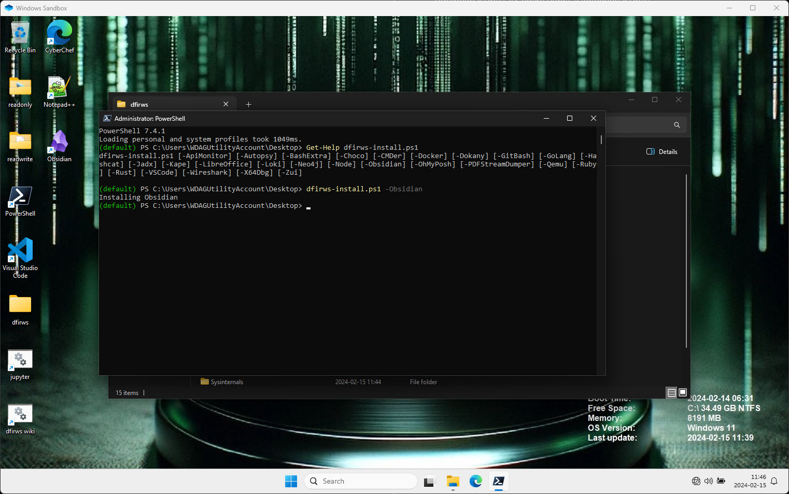

There are a couple of ways to configure and customize **dfirws**.

- Change settings in the *dfirws.wsb* file. Enable copy/paste, enable printing etc. You can also mount more folders.
- Change installed programs in *local\config.txt*. Copy the file *local\defaults\config.txt* to *local\config.txt* and edit the file to set your own defaults.
- Change shortcuts on the desktop or run your own **PowerShell** command on startup by creating *local\customize.ps1* by copying *local\defaults\customize.ps1*.
- Create your own version of *.bashrc*, *.zshrc*, *.zcompdump* and *Microsoft.PowerShell_profile.ps1* by copying the the corresponding default file from *.\local\defaults* folder to the *.\local* folder, i.e. **Copy-Item .\local\defaults\Microsoft.PowerShell_profile.ps1 .\local\Microsoft.PowerShell_profile.ps1**

To install a program for the current session you can use **dfirws-install.ps1**. In the image below the command **dfirws-install.ps1** is used to install [Obsidian](https://obsidian.md/). The command is **dfirws-install.ps1 -Obsidian**.

