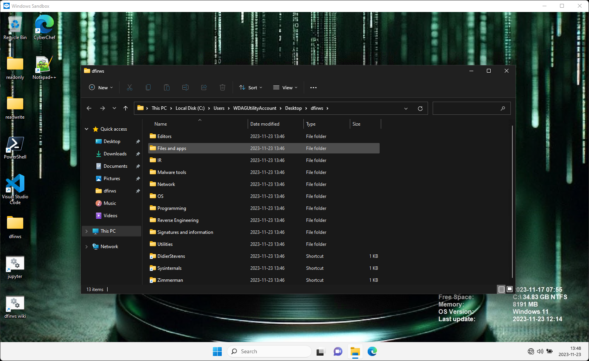
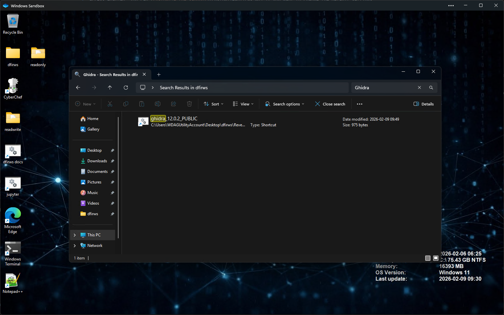

# Getting started

This page will help you get started with **dfirws**. If you haven't downloaded the sandbox yet please see the project [README.md](https://github.com/reuteras/dfirws/blob/main/README.md).

After installation you have you can choose between starting **dfirws.wsb** and **network_dfirws.wsb**. The first one has no network access and the other  has network access enabled. You can [customize the sandbox](Customize-dfirws.md) if you want to change the default settings.

When the sandbox is running you should see this screen:

You can search for tools in the search bar (in this case Ghidra):

If you like to access a local version of this wiki click on *dfirws wiki*. If you like to use a [[Jupyter notebooks]] to investigate files click on *jupyter*.

Links to some of the installed tools can be found if open the folder *dfirws* on the desktop. (**Help wanted:** If you have any suggestions on how to make it easier to find the tools please create an [issue](https://github.com/reuteras/dfirws/issues)).

Tools are generally found under *C:\Tools* if they don't require setup or installation. Installed tools are installed in their default location (*C:\Program files* in most cases). Python based tools are in virtual environments under *C:\venv*. Git repositories are stored under *C:\git*. If you have opted in to download data for enrichment that data is available under *C:\enrichment*.

## Security

Personally I wouldn't run malware in a Windows sandbox. I prefer to do that in a virtual machine. Even if there are tools included in the sandbox for running and debugging malware I wouldn't recommend that you use them in that way.
