# Investigate OneNote files

Included tools (not a complete list).

- [pyOneNote][pon]
- [onedump.py][opy]

## Example

The file is available on [Malware Bazaar](https://bazaar.abuse.ch/sample/29d154eafeb75a7059fc164c70ae746c6f3eb83d29853b3856d0aa8f8df0adde/).

First lets unpack the file.

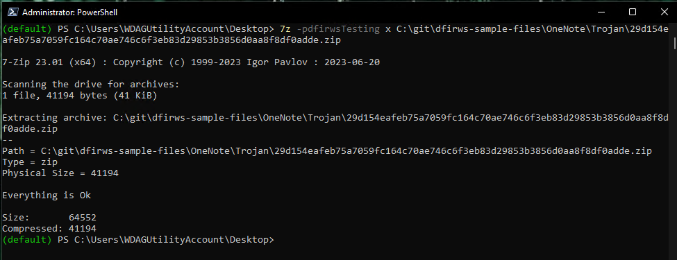

We can use **Yara**, **file-magic.py**, **file.exe** and **trid.exe** to check the file.

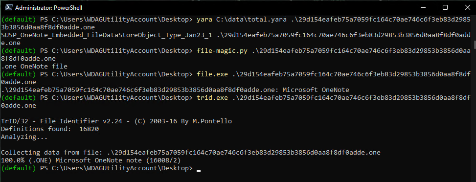

The tools **onenote.py** and **pyonenote.exe** are two tools that can be used to extract files from OneNote documents.

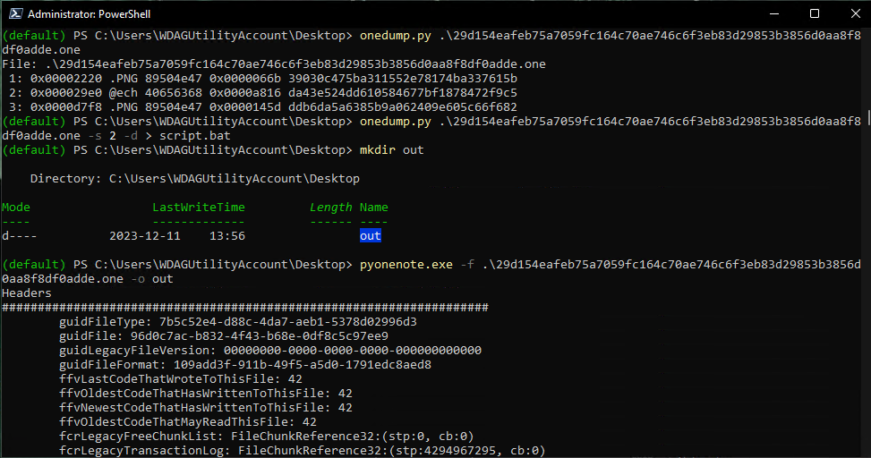

Output from **pyonenote.exe**.

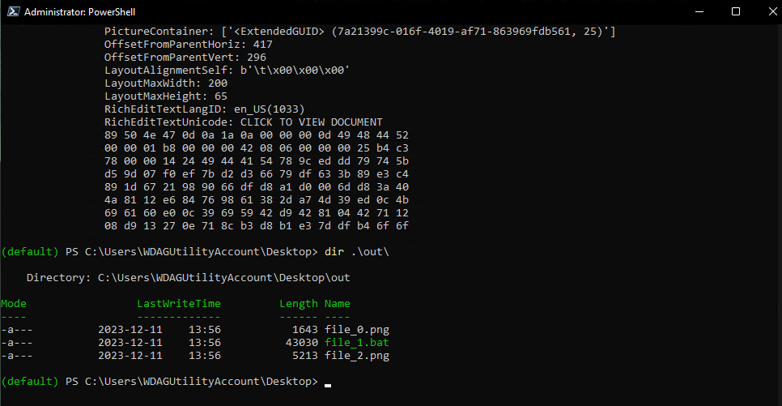

Look at *file_1.bat* (named by **pyonenote.exe**) in **Notepad++**. Remove the first line.

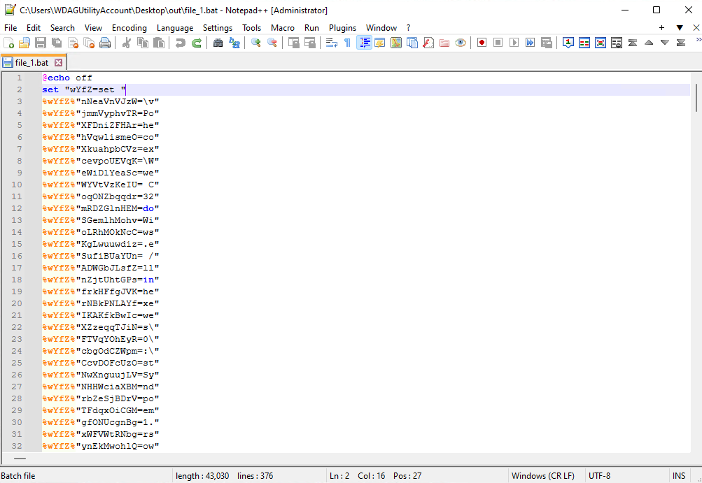

Cut line `61` and save it for later.

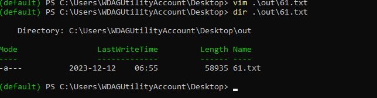
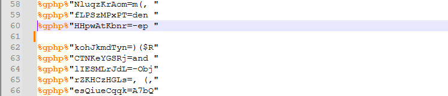

The last lines of the files looks like this.

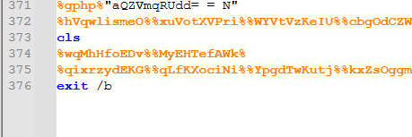

Change the last line of the file to:

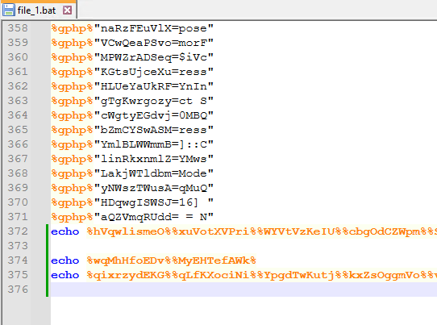

Save the file and run it. **WARNING** This is malware and it can infect your computer!

Copy the command part of the output.

The command in **Notepad++**. Only two lines when pasted.

Change ";" to "\n".

The PowerShell script is now a bit easier to read. Almost the same code, use the second half.

We can see that the code gets line 61 from the first *bat* file.

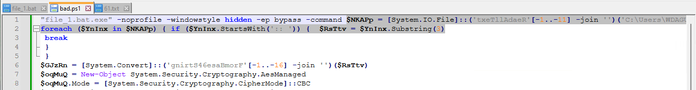

Modified script with line 61 inserted and a added **Write-Host** statement and the last lines commented out.

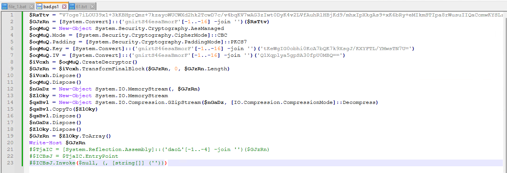

Run the command.

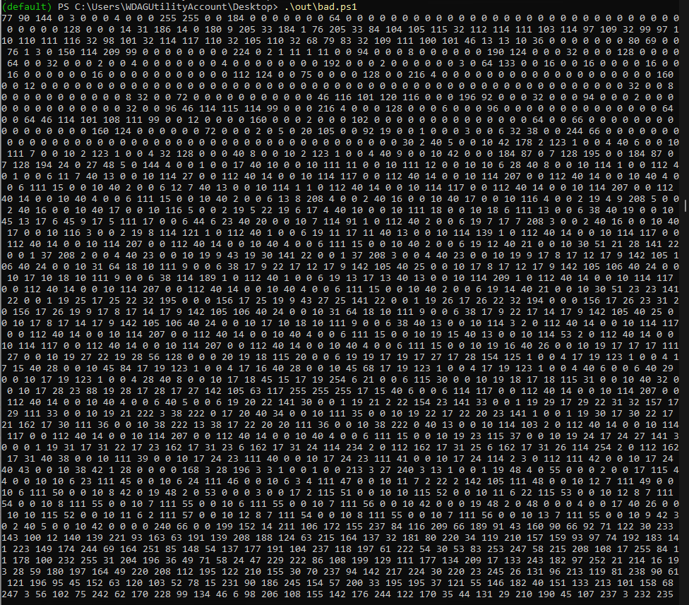

Copy and paste the output from the command to **CyberChef** and use its **magic** functions.

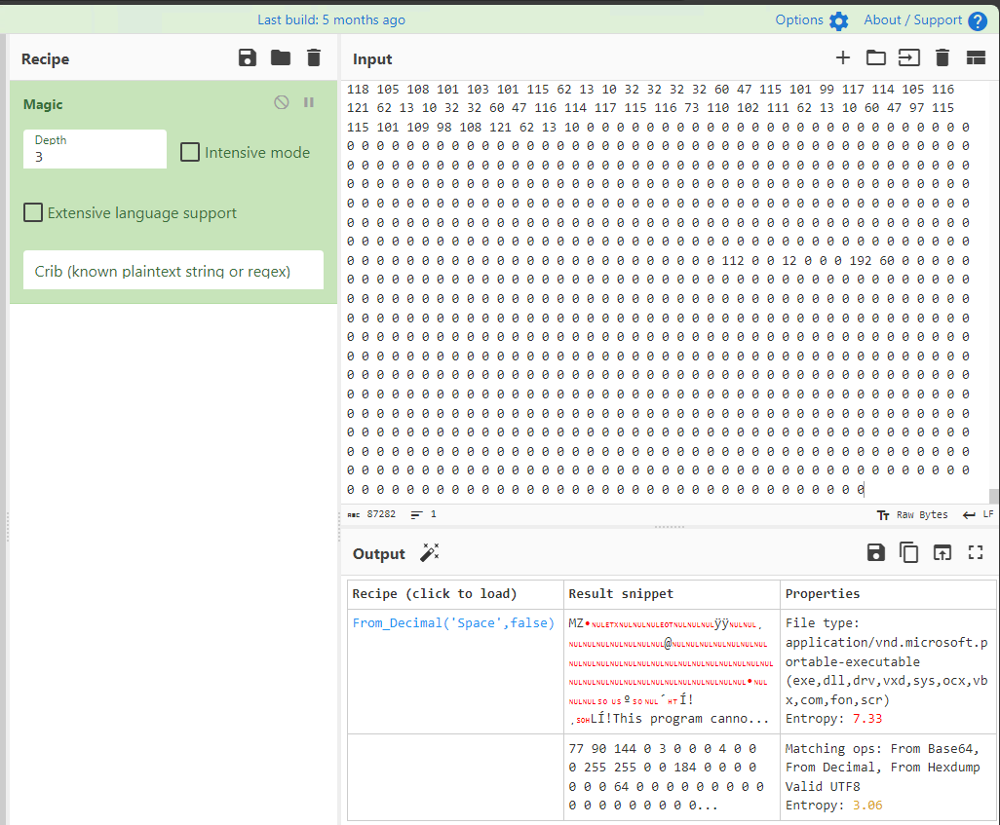

Press the disc icon to save the output to file (a MZ-file).

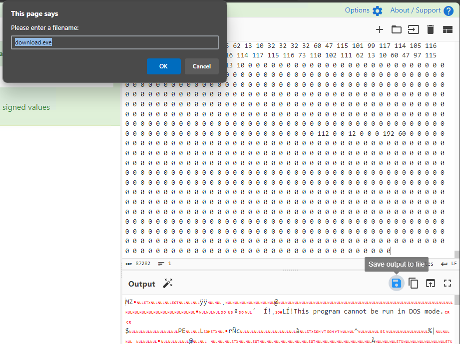

You have to press keep to save the file.

The file is now under *~/Downloads*.

We can check the file with **capa.exe**.

Look at available tools matching *PE*.

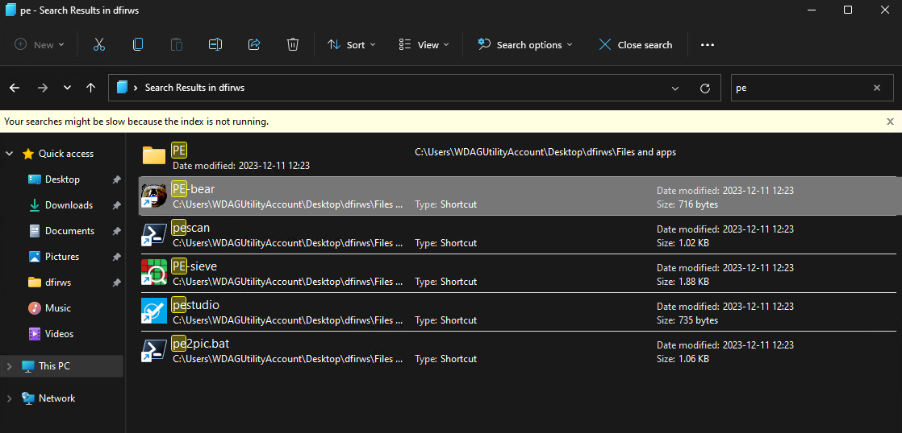

Open in **pestudio**. We can see that it is a 32-bit .Net binary

We can use *dnSpy32* to look at it. Let's search for the program.

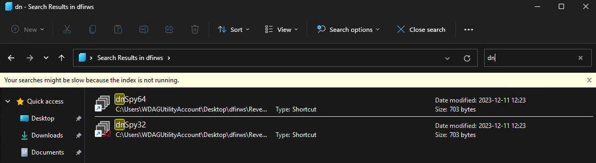

The file opened at the *main* function in **dnSpy32**.

  [opy]: https://github.com/DidierStevens/Beta/blob/master/onedump.py
  [pon]: https://pypi.org/project/pyOneNote/
