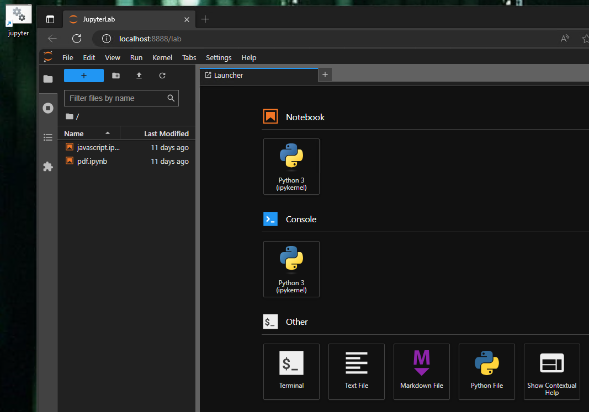

Trying to add Jupyter Notebooks under [setup/jupyter](https://github.com/reuteras/dfirws/tree/main/setup/jupyter) to be able to automate investigations as much as possible. At the moment there are notebooks for

- [Javascript](https://github.com/reuteras/dfirws/blob/main/setup/jupyter/javascript.ipynb)
- [PDF](https://github.com/reuteras/dfirws/blob/main/setup/jupyter/pdf.ipynb)
- [PE with Ghidra and capa](https://github.com/reuteras/dfirws/blob/main/setup/jupyter/PE_-_Ghidra_-_capa.ipynb)

Wiki pages with more information:

- [Notebook for PE with Ghidra and capa](Notebook-for-PE-with-Ghidra-and-capa.md)

More inspiration can be found from [jupyter-collection](https://github.com/fr0gger/jupyter-collection/) by [fr0gger](https://github.com/fr0gger) and available locally under *C:\git\jupyter-collection*.

Click on the link *jupyter* on the desktop to start **Jupyter Labs**:

