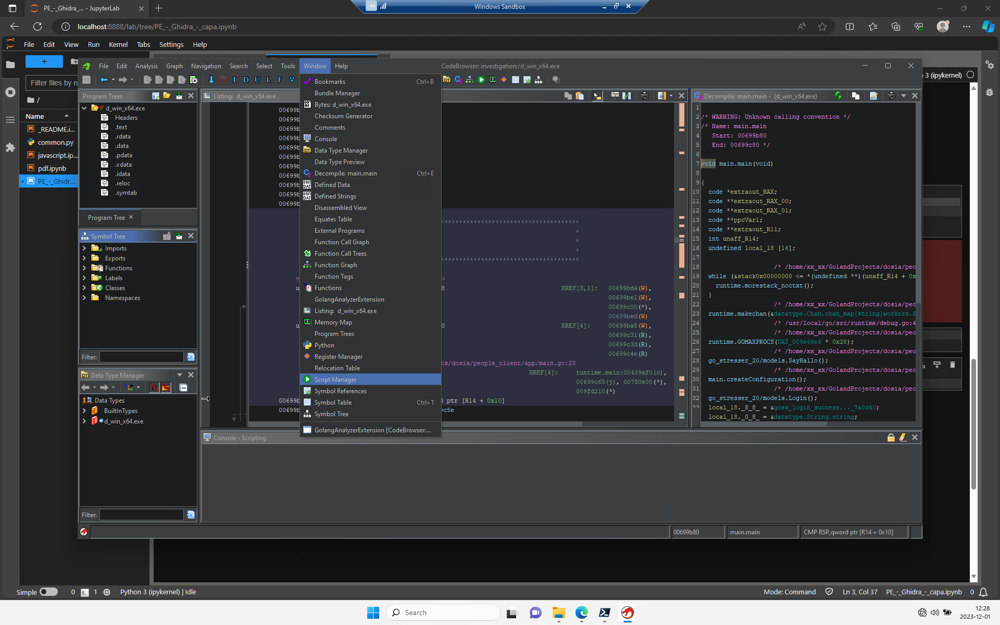
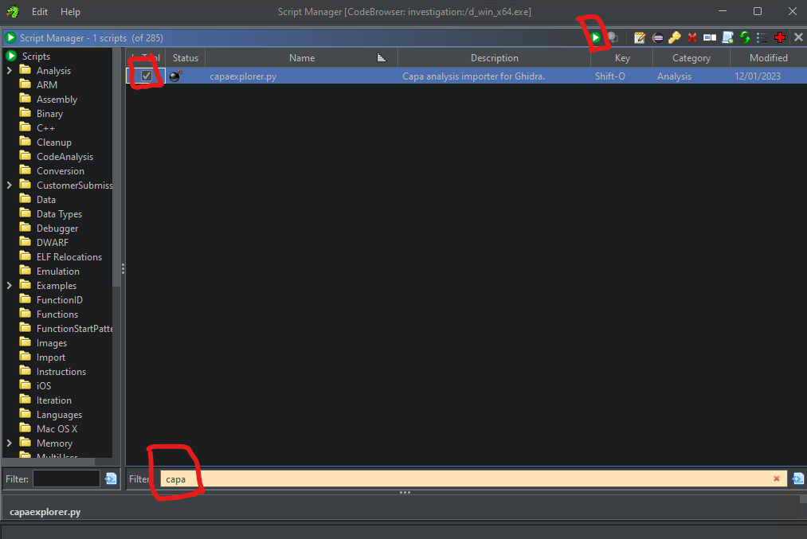
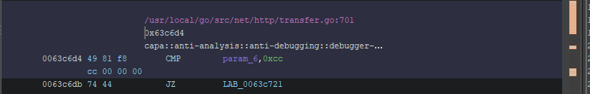

If you run this notebook you can view the results from a run with [capa][cap] on the file and then import the `JSON` output from **capa** to [Ghidra][ghi] with the help of [CapaExplorer][cae]. The file analyzed below is [c0cb3a111965e1446e17f6077368164f324dc0f82333a534ee2826df57496bb7][c0c] which is the DDosia client for Windows updated in november of 2023 and it's written in GoLang.

When the notebook is done and **Ghidra** has started you can start the *Script Manager*:

Then type *capa* in the filter in *Script Manager* to find the script **capaexplorer.py* and select the checkbox and then press the green button to run it.

When the file window opens with the title *Drltrace log* select the correct `JSON` file and press *Choose file:*.

When the pane *Console - Scripting* has the text *Finished!* on the last line the import of the `JSON` data is done.

You will now have a new namespace called *capa* in the *Symbol Tree* (you might have to open and close the namespace one extra time).

You can also see the **capa** data in the *Listing* pane for the file.

  [c0c]: https://www.virustotal.com/gui/file/c0cb3a111965e1446e17f6077368164f324dc0f82333a534ee2826df57496bb7
  [cae]: https://github.com/mari-mari/CapaExplorer
  [cap]: https://github.com/mandiant/capa
  [ghi]: https://github.com/NationalSecurityAgency/ghidra

