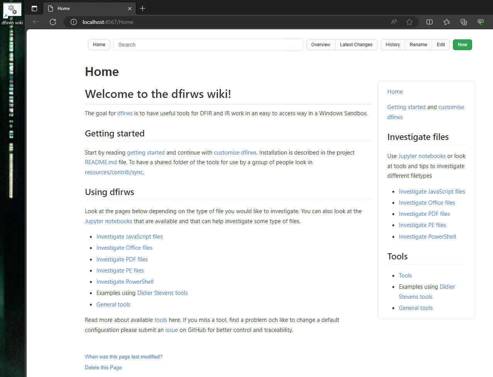

# Welcome to the dfirws wiki

The goal for [dfirws](https://github.com/reuteras/dfirws) is to have useful tools for DFIR and IR work in an easy to access way in a Windows Sandbox.

## Getting started

Start by reading [getting started](Getting-started.md) and continue with [customize dfirws](Customize-dfirws.md). Installation is described in the project [README.md](https://github.com/reuteras/dfirws/blob/main/README.md). To have a shared folder of the tools for use by a group of people look in [resources/contrib/sync](https://github.com/reuteras/dfirws/tree/main/resources/contrib/sync). Also look at [changes](Changes.md) to get information about updates and changes.

## Using dfirws

Look at the pages below depending on the type of file you would like to investigate. You can also look at the [Jupyter notebooks](Jupyter-notebooks.md) that are available and that can help investigate some type of files.

- Examples using [Didier Stevens tools](Didier-Stevens-tools.md)
- [Investigate Email](Investigations/Investigate-Email.md)
- [Investigate JavaScript files](Investigations/Investigate-JavaScript-files.md)
- [Investigate Office files](Investigations/Investigate-Office-files.md)
- [Investigate OneNote file](Investigations/Investigate-OneNote-file.md)
- [Investigate PDF files](Investigations/Investigate-PDF-files.md)
- [Investigate PE files](Investigations/Investigate-PE-files.md)
- [Investigate PowerShell](Investigations/Investigate-PowerShell.md)
- [Investigate ZIP files](Investigations/Investigate-ZIP-files.md)
- Generated tool documentation available at [Tools](tools/index.md).

Read more about [available tools](tools/index.md) here. If you miss a tool, find a problem och like to change a default configuration please submit an [issue](https://github.com/reuteras/dfirws/issues) on GitHub for better control and traceability.

This wiki is also available in every running sandbox by clicking on the *dfirws wiki* link on the desktop:

